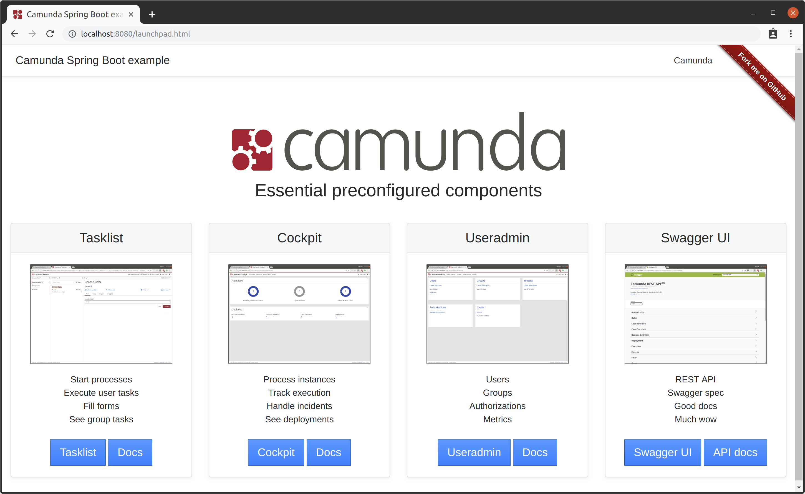

# Spring Boot Web application with Camunda Webapps

Forked from https://github.com/camunda/camunda-bpm-examples/tree/master/spring-boot-starter/example-webapp?ref=7f807189b443c2f10e8cb192303a46b0fef7ac62

This example demonstrates how you can build Spring Boot Web application having following configured:

* Spring Boot2 + Java8
* Embedded Camunda engine
* Camunda web applications 
* Process application and one BPMN process deployed
* Test user configured with login and password in `application.properties`
* Process sample
* Decision table sample
* Service task sample
* External service task sample
* Process unit testing
* Launchpad - introduction page




## Building

Execute following:

```bash
mvn clean package
```

## Running

To run application at http://localhost:8087 execute:

```bash
mvn spring-boot:run
```

## Available services:

* Cockpit
* Tasklist
* Admin

